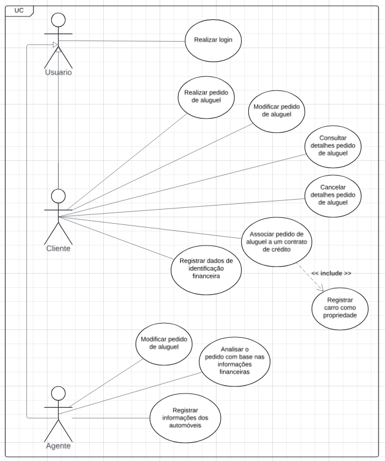
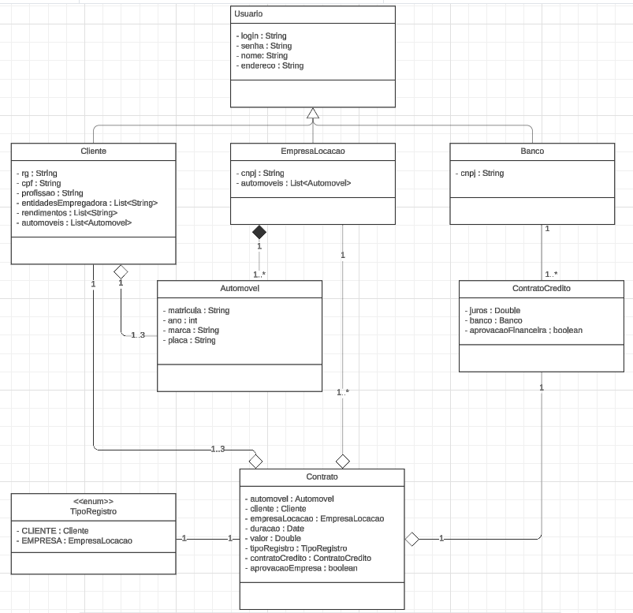
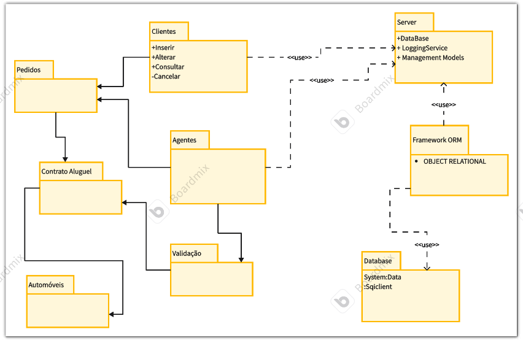
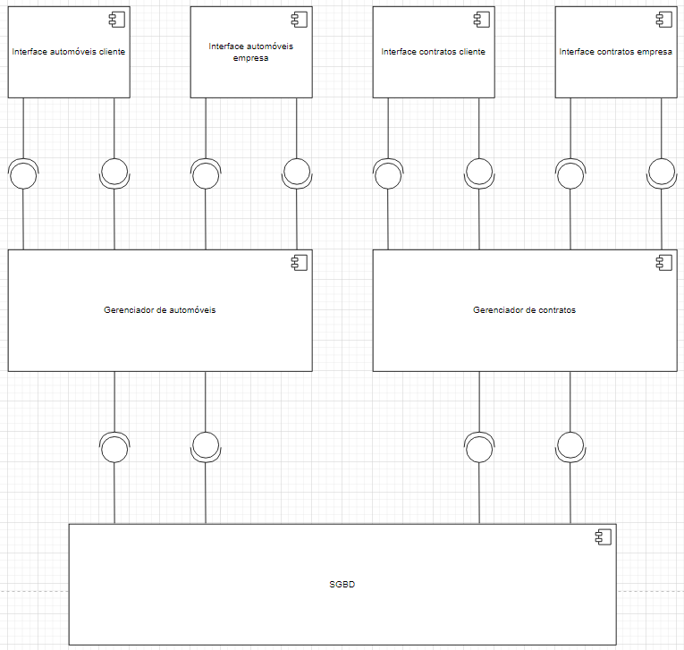
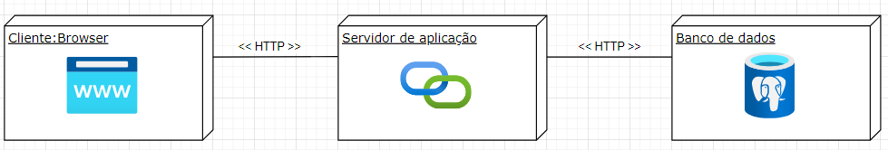

# LDS-Lab02
### Sistema de Aluguel de Carros
O Sistema de Aluguel de Carros é uma plataforma online desenvolvida para facilitar e gerenciar o processo de aluguel de automóveis, atendendo tanto clientes individuais quanto agentes, como empresas e bancos. O sistema é acessível após o cadastro, permitindo que os usuários realizem diversas operações relacionadas ao aluguel de veículos.

### Diagrama de Caso de Uso

### Diagrama de Classes

### Diagrama de Pacotes

### Diagrama de Componentes

### Diagrama de Implantação

### Histórias de Usuário

| **História de Usuário** | **Como**        | **Quero**                               | **Para**                                       |
|-------------------------|-----------------|-----------------------------------------|------------------------------------------------|
| UC1 | Cliente     | Me cadastrar no sistema                              | Poder fazer pedidos de aluguel                            |
| UC2 | Cliente     | Acessar o sistema após o cadastro                             | Gerenciar meus pedidos de aluguel                |
| UC3 | Agente     | Me cadastrar no sistema                              | Poder modificar e avaliar pedidos de clientes              |
| UC4 | Agente     | Acessar o sistema após o cadastro                             | Gerenciar pedidos de aluguel de clientes          |
| UC5 |	Cliente	   |     Realizar um pedido de aluguel            |  	Obter o automóvel desejado   |
| UC6 |	Cliente |	Modificar um pedido de aluguel	| Ajustar informações do contrato |
| UC7 |	Cliente |	Consultar os detalhes de um pedido de aluguel |	Verificar o status do pedido |
| UC8 |	Cliente | Cancelar um pedido de aluguel |	Desistir da reserva de um automóvel |
| UC9 |	Agente	| Modificar os pedidos de aluguel	| Ajustar termos ou condições do contrato |
| UC10 |	Cliente |	Associar o pedido de aluguel a um contrato de crédito	| Financiar o aluguel do automóvel |
| UC11 |	Agente	| Analisar o pedido com base nas informações financeiras |	Aprovar ou rejeitar o contrato de aluguel |
| UC12 |	Cliente |	Registrar os meus dados de identificação e financeiros | Garantir a validação e segurança dos contratos |
| UC13 |	Agente	| Registrar as informações dos automóveis |	Permitir que os veículos sejam alugados |
| UC14 |	Cliente	| Registrar um carro como minha propriedade |	Permitir que os veículos sejam alugados corretamente de acordo com o tipo de contrato |
